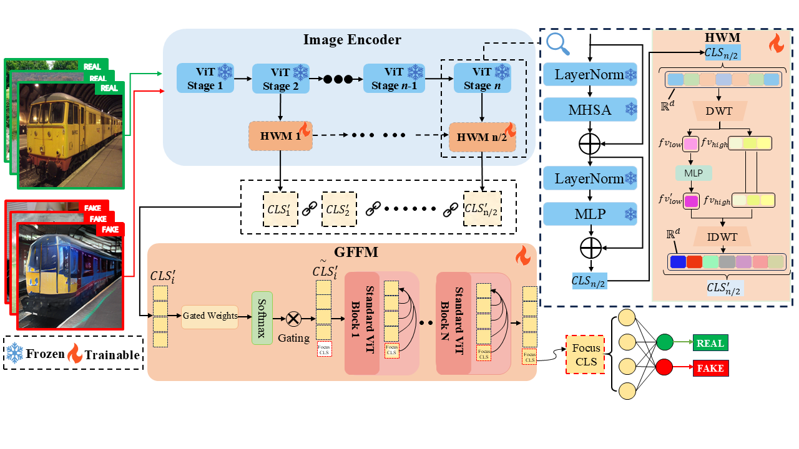

# Hierarchical-Wavelet-Gated-Former-HWGF
This paper proposes a pretrained-model-based forgery detection method that does not rely solely on searching for forgery artifacts in the original image pixel domain. Instead, it directly performs frequency-domain analysis and adaptive fusion within the multi-layer feature representation space of the CLIP image encoder, thereby enhancing the generalization capability for detecting forged images generated by different generative models. The technical pipeline of the proposed method is illustrated as follows: first, the input image is uniformly preprocessed and fed into a frozen CLIP ViT backbone to extract multi-layer [CLS] features; subsequently, Discrete Wavelet Transform (DWT) and Inverse Discrete Wavelet Transform (IDWT) are applied to the [CLS] features from multiple selected layers. Then, a gated frequency-domain fusion module is employed to assign learnable weights to frequency-domain features from different layers, while a lightweight Transformer is introduced to aggregate the weighted multi-layer features, producing the final global discriminative representation. Finally, the representation is fed into a linear classifier to output the forgery probability, and the authenticity of the image is determined according to the predicted probability.

  

